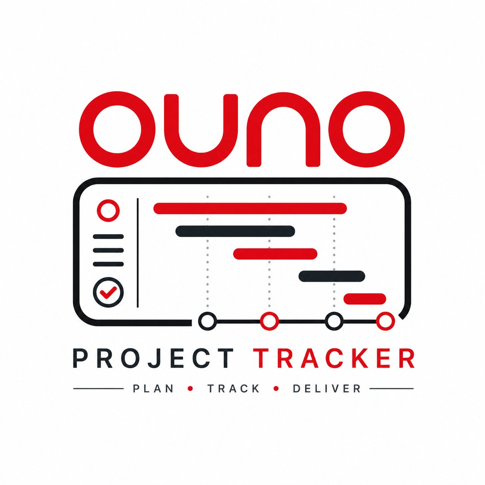

# OUNO Project Tracker

<div align="center">
  
  
  **Plan · Track · Deliver**
  
  [](https://react.dev)
  [](https://vitejs.dev)
  [](LICENSE)
</div>

---

## Nedir?

OUNO Project Tracker, birden fazla projenin aynı anda birden fazla departman tarafından takip edildiği, **yapay zeka destekli** kurumsal proje yönetim uygulamasıdır.

Mail ve WhatsApp üzerinden yürütülen proje koordinasyonunu tek, güvenli ve akıllı bir platforma taşır.

## Temel Özellikler

- **AI Omurga Motoru** — Proje tanımından otomatik departman sırası, sprint planı ve görev yapısı oluşturur
- **Davet Bazlı Erişim İzolasyonu** — Davet edilmeyenler projenin varlığından haberdar olamaz
- **3 Katmanlı Proje Hiyerarşisi** — Ekosistem → Alt proje → Görev
- **Departman Tetikleyicileri** — Bir departman tamamlayınca sonraki otomatik bildirilir
- **Agile Sprint Döngüsü** — Sprint planlama, review, retrospektif
- **WhatsApp Köprüsü** — WA Business API ile çift yönlü mesaj senkronizasyonu
- **Yerleşik Mesajlaşma** — Proje bazlı izole kanallar
- **Dosya Sistemi** — PDF, Excel, JPG, PNG — aşamaya ve göreve bağlanabilir
- **Tooltip Sistemi** — Tüm fonksiyon alanlarında hover ile kullanım rehberi
- **Devam Eden Proje Göçü** — Mevcut projeleri AI destekli orta noktadan sisteme al

## Departman Yapısı

11 birim: Ürün Yönetimi · Pazarlama · Satış · İthalat · Finans · Teknik Servis · Yazılım · Hukuk · Yönetim Kurulu · Agile Yapısı · Proje Lideri

## Rol Hiyerarşisi

| Rol | Seviye | Proje Görünürlüğü |
|-----|--------|-------------------|
| YK Başkanı | 1 | Tüm projeler + arşiv |
| Admin | 2 | Tüm projeler |
| Proje Lideri | 3 | Atandığı projeler |
| Proje Başlatıcı | 3 | Açtığı projeler |
| Üye | 4 | Davet edildiği projeler |

## Kurulum

```bash
# Bağımlılıkları yükle
npm install

# Geliştirme sunucusu
npm run dev

# Production build
npm run build

# Build önizleme
npm run preview
```

## Teknoloji

- **Frontend:** React 18 + Vite 5
- **UI:** Sıfırdan yazılmış bileşenler, OUNO marka sistemi
- **Font:** DM Sans + DM Mono
- **İkonlar:** Lucide React
- **AI Entegrasyonu:** Anthropic Claude API (production)

## Proje Yapısı

```
src/
├── components/
│   ├── UI.jsx          # Temel bileşenler (Button, Card, Tooltip, Avatar...)
│   ├── Sidebar.jsx     # Sol navigasyon
│   └── Topbar.jsx      # Üst bar
├── data/
│   └── mockData.js     # Mock veri (departments, projects, users)
├── pages/
│   ├── Dashboard.jsx   # Ana dashboard
│   ├── Messages.jsx    # Mesajlaşma + WA köprüsü
│   ├── Files.jsx       # Dosya yönetimi
│   └── AIAssistant.jsx # AI asistan & uyarılar
├── App.jsx             # Ana uygulama & routing
├── main.jsx            # Entry point
└── index.css           # Global stiller & OUNO tasarım sistemi
```

## Ekran Görüntüleri

### Dashboard
Tüm projeler, AI uyarıları, görevler ve proje aşamaları tek ekranda.

### AI Asistan
Proje analizi, gecikme tespiti, omurga önerisi ve proaktif uyarılar.

### Mesajlaşma
Proje bazlı izole kanallar ve WhatsApp köprüsü entegrasyonu.

### Dosya Merkezi
PDF, Excel, görsel yükleme — aşamaya ve göreve bağlama.

## Deployment

```bash
# Vercel
vercel --prod

# Netlify
netlify deploy --prod --dir=dist

# GitHub Pages
npm run build && gh-pages -d dist
```

## Lisans

© 2026 OUNO. Tüm hakları saklıdır.

---

<div align="center">
  <strong>OUNO Project Tracker</strong> · Plan · Track · Deliver
</div>
